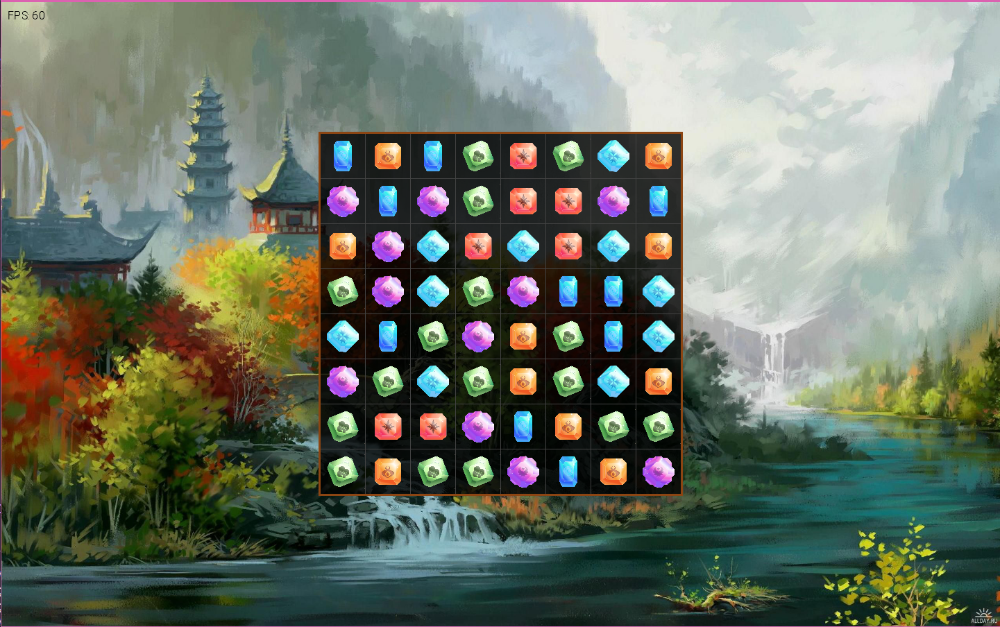

# DiamondRush

DiamondRush is a match-3 puzzle game built with [MonoGame](https://www.monogame.net/) and a custom ECS (Entity Component System) architecture. The project demonstrates modern C# 12 features and targets .NET 8.

## Features

- **Match-3 Gameplay:** Swap gems to create matches and collect them.
- **Entity Component System:** Uses [LightECS](https://github.com/laura-kolcavova/LightECS) for flexible game logic.
- **Animation & Effects:** Gem animations and sound effects for collecting and swapping.
- **Modular Systems:** Includes systems for input, matching, swapping, collecting, falling, spawning, rendering, and sound.

## How It Works

- **Systems** process game logic each frame (e.g., matching, collecting, animating).
- **Messages** are used for decoupled communication between systems (e.g., `GemCollectingStartedMessage`).
- **Components** store entity state (e.g., position, animation progress).
- **Renderers** draw entities using MonoGame's `SpriteBatch`.

---

*Built with MonoGame and C# 12.0*